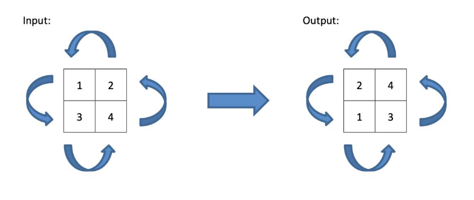
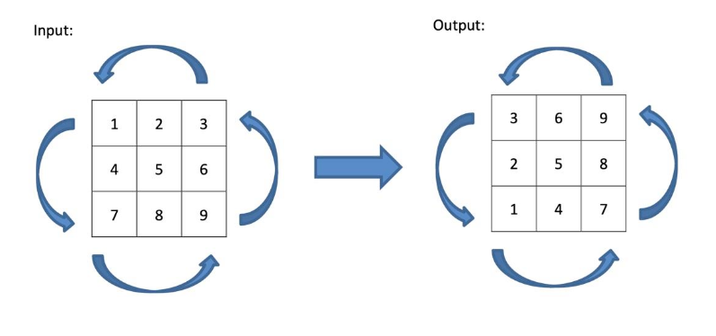

<div align="center">
  
</div>

# Delosi - Prueba Técnica

## Descripción

Se tiene el requerimiento de crear una vista en Next.js con las mejores prácticas tanto en el código como en SEO.

En base a ello, se requiere implementar una vista donde se pueda ingresar un array de arrays de números que conformen una matriz de NxN el ingreso de este array que sea dinámico, y se devuelva la misma matriz que represente la imagen, pero rotada en sentido anti-horario (90 grados). Se debe controlar correctamente los errores. Considerar que esta primera versión será la base para que posteriormente otros desarrolladores puedan incluir los demás requerimientos que aún están en definición, por lo que la solución debe garantizar la mantenibilidad y escalamiento.

**Se evaluará el correcto funcionamiento de todas las opciones implementadas y la creación de las pruebas unitarias**.

Enviar la solución completa (URL del repo) y un ejemplo de ejecución.

## Ejemplos

```js
// Ejemplo 1
// input : [[1,2],[3,4]]
// output: [[2,4],[1,3]]
```



```js
// Ejemplo 2
// input : [[1,2,3],[4,5,6],[7,8,9]]
// output: [[3,6,9],[2,5,8],[1,4,7]]
```


